# [안드로이드 개발](https://github.com/hsik421/resume)

***

# GIT - 프리랜서
2024.12.11 ~ 2025.12.31

## 진단기 부가기능 신규기능 추가 및 유지보수

## 기술스택
+ Kotlin/Java

## FLOW
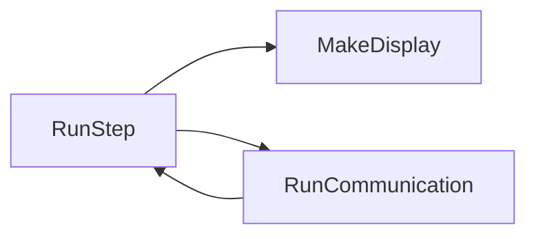
+ RunStep(step : Int)
    - ui / can 통신 / dialog 분기 처리

+ MakeDisplay(step : Int)
    - ui 전/후 처리(동적)

+ RunCommunication(step : Int)
    - can 통신 / data security algorithm


## DATA
### Xml File
+ next Step
+ data encode (ascii / hex / signed ..)
+ messageIndex(load sqlite)
+ request/response value


### can : 1234 08 11 22 33 44 55 66 77 88

| 구분          | 내용                      | 설명                 |
|-------------|-------------------------|--------------------|
| **ID 영역**   | 0x1234                  | 메시지 구분자 (예: 엔진 정보) |
| **DLC 영역**  | 08                      | 데이터가 8바이트          |
| **DATA 영역** | 11 22 33 44 55 66 77 88 | 실제 센서 또는 명령 데이터    |

+ *.xml 파일에서 받아온 position / size 값으로 11 22 / 33 44 / 55 / 66 77 88 잘라서 사용

### 신규/기존 기능 추가 및 유지 보수

### File 추가
1. HY/KM Storage __*.xml(암호화 파일)__ add
2. language.sqlite add
3. 차종 정보.sqlite add

### APP 업데이트 일정
매월 2주 4주차 업데이트


***


## 울산 자동차 공장에서 사용하는 App
자동차 출고 전 상태 체크 및 점검

## 기술스텍
+ Kotlin
+ Barcode scan ([Zxing](https://github.com/zxing/zxing))
+ TCP/IP Socket
+ Local Database ([Room](https://developer.android.com/jetpack/androidx/releases/room?hl=ko))
+ Dependency Injection ([Hilt](https://developer.android.com/training/dependency-injection/hilt-android?hl=ko))
+ Room

## 아키텍처

### MVVM 구조 적용
### Data Flow
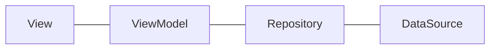

### ViewModel lifecycle

| viewmodel       | lifecycle |
|-----------------|-----------|
| SocketViewModel | activity  |                          
| IntroViewModel  | activity  |                        
| other           | fragment  |                       


## Package 구조

```bash
├── base
├── data
│   ├── datasource
│   ├── local
│   ├── model
│   ├── repository
│   └── client
├── di
├── ui
│   ├── admin
│   ├── dialog
│   ├── hivis
│   ├── login
│   ├── main
│   ├── scan
│   └── search
├── util
└── viewmodel
```
+ base : View 추상 클래스
+ data : 비즈니스 로직 및 데이터 관리
+ di : 의존성 주입 모듈
+ ui : UI 관련 클래스 (화면 구성)
+ util : 프로젝트 전반에서 활용할 유틸리티


## UI 레이어

### ui flow
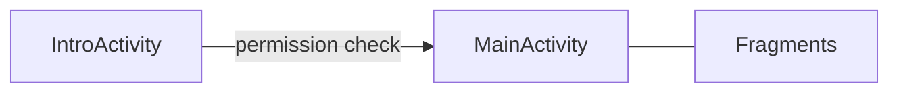
### fragment 구성
<picture>
  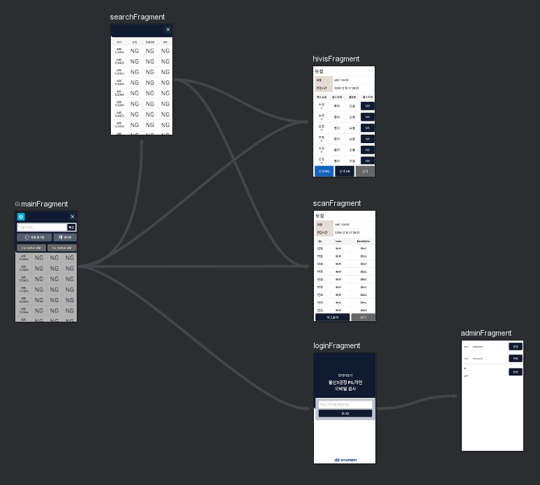
</picture>

## Socket 통신

### SequenceDiagram

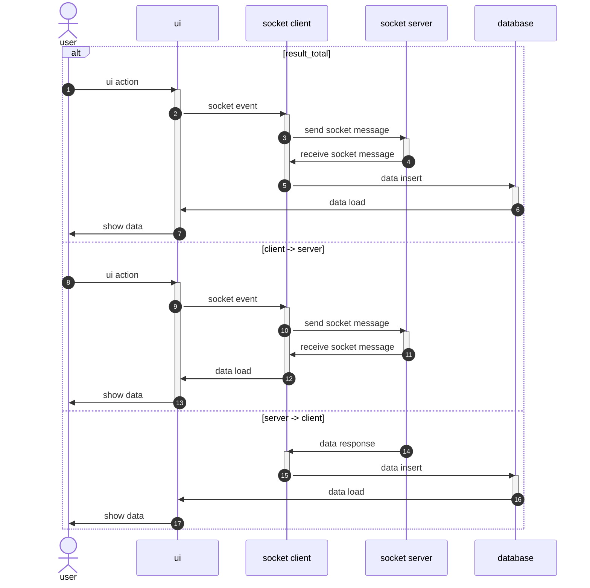

### Socket request type

```kotlin
object SocketConstants {
    const val PRINT_SIGN_OFF = "print_signoff"
    const val PRINT_SSCAN = "print_sscan"
    const val CHANGE_HIVIS = "change_hivis"
    const val RESULT_TOTAL = "result_total"
    const val RESULT_HIVIS = "result_hivis"
    const val RESULT_SSCAN = "result_sscan"
    const val RESULT_SIGN_OFF = "result_signoff"
    const val CAR_MASTER_INFO = "carmaster_info"
    const val SEARCH_TOTAL = "search_total"
    const val LOGIN = "login"
}
```


result_total, print_sscan, print_signoff -> Database에 insert/update flow 적용


## config_test.json
내부 Database에 table[Network/IpAddress] empty value 일 경우 IntroViewModel 에서 config_test.json 값을 insert 처리

### 개발기간 : 2024.12.11 ~ 2025.2.24
### 개발인원 : 1명


***

# (주)앤씨앤 - 프리랜서

## [VUEROID](https://play.google.com/store/apps/details?id=kr.ncn.vueroid.d21&hl=ko)

사진/동영상 파일 I/O, 운행기록 그래프 표시

## 기술스택
+ Kotlin
+ [MPAndroidChart](https://github.com/PhilJay/MPAndroidChart)
+ WebSocket
+ File I/O


## 아키텍처
+ MVVM


### File List
RecyclerView Zoom 기능 (Zoom 이벤트 발생 시 spanCount 변경)

Cloud / 블랙 박스 / SD Card / Local 저장소 파일 입출력


### History
MPAndroidChart 사용 하여 일/주/월/연 단위로 데이터 취합 및 Graph 적용

#### screenshot
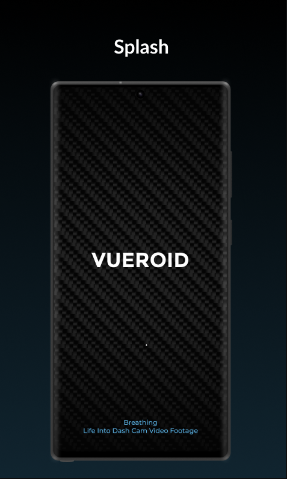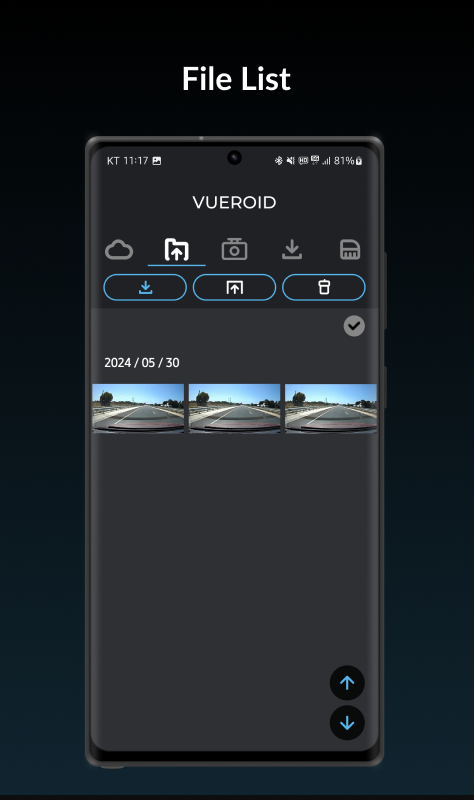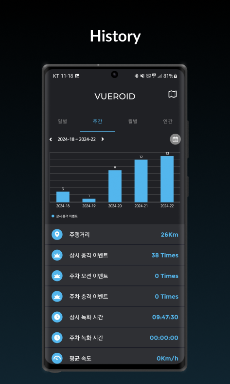


***


# Hackers Education Group · 정규직

### 2016년 11월 - 2022년 11월

## [해커스 토익기출보카](https://play.google.com/store/apps/details?id=com.hackers.app.toeicvoca)

### 기술스택
+ Kotlin
+ DataBinding
+ coroutine
+ retrofit2
+ room
+ firebase
+ lottie
+ ExoPlayer

### 아키텍처
+ MVVM

#### 개발기간 : 3개월
#### 개발인원 : 1명

#### screenshot
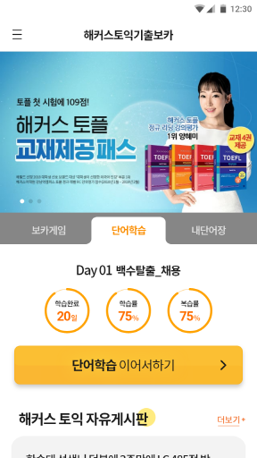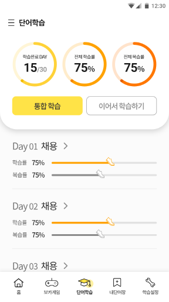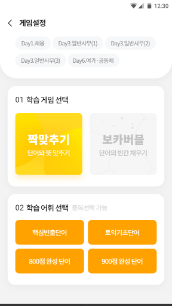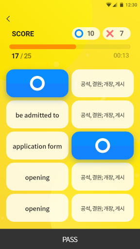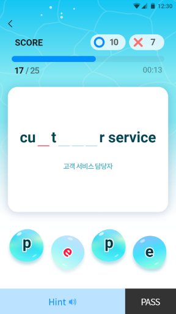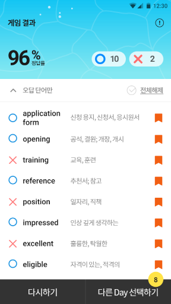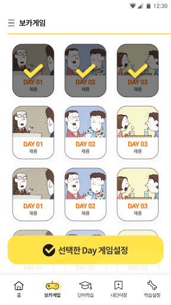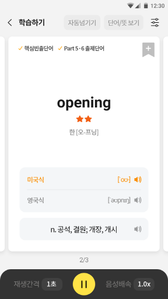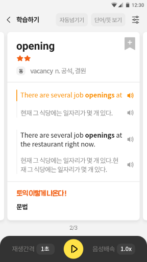


***

## [해커스 그림보카](https://play.google.com/store/apps/details?id=com.hackers.voca.imvoca)

### 기술스택
+ Kotlin
+ DataBinding
+ retrofit2
+ room
+ firebase
+ RxJava
+ ExoPlayer

### 아키텍처
+ MVC -> MVP -> MVVM
#### 개발기간 : 2개월
#### 개발인원 : 1명

#### screenshot
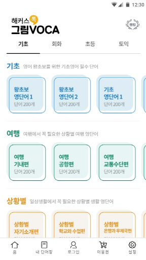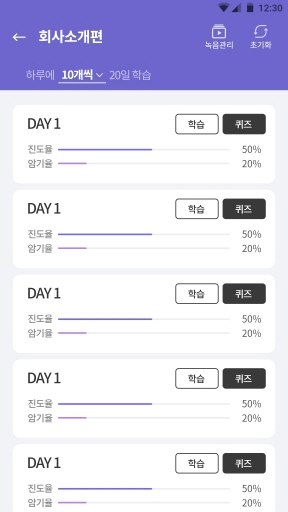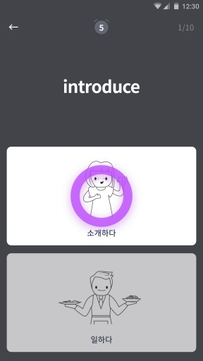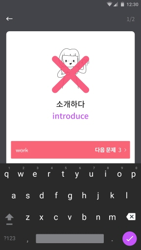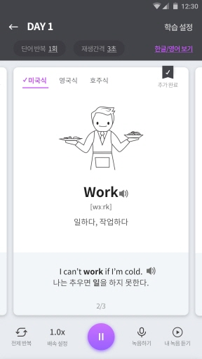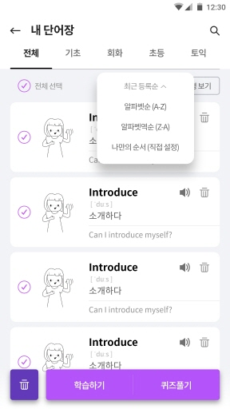

***

## [해커스 MP3 Player](https://play.google.com/store/apps/details?id=com.hackers.app.hackersmp3)

### 기술스택
+ Kotlin
+ DataBinding
+ retrofit2
+ room
+ firebase
+ RxJava
+ ExoPlayer

### 아키텍처
+ MVVM

#### 개발기간 : 19.06.17 ~ 19.09.30
#### 개발인원 : 1명

#### screenshot
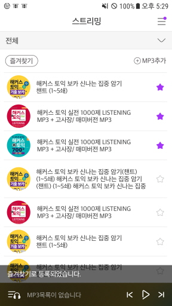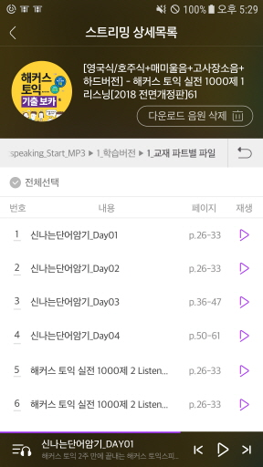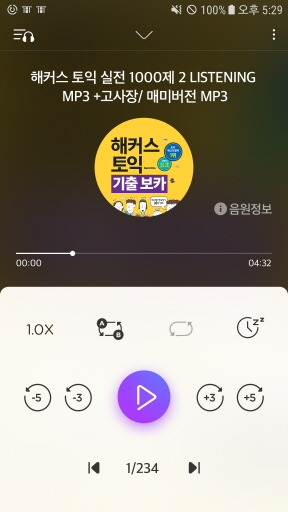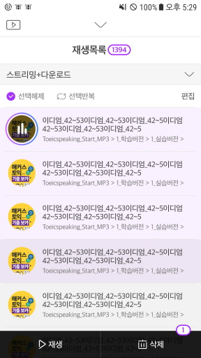


***


### [해커스 빅플](https://play.google.com/store/search?q=%EB%B9%85%ED%94%8C&c=apps)

### 기술스택
+ Kotlin
+ Rxjava
+ retrofit2
+ MediaPlayer

### 아키텍처
+ MVP

#### 개발기간 : 2개월
#### 개발인원 : 1명

#### screenshot
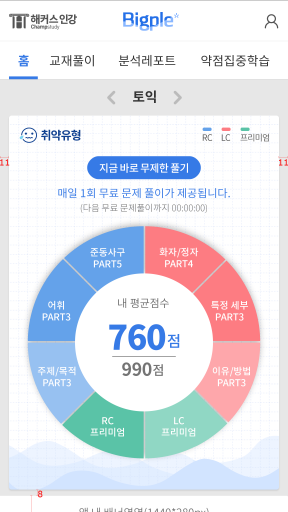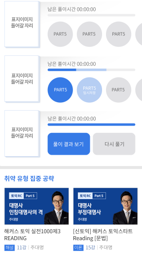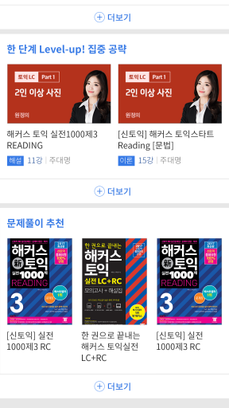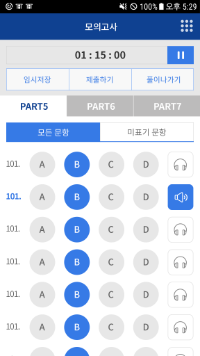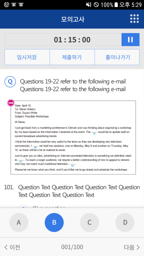

***

### 해커스 알람기능 모듈

### 기술스택
+ Kotlin
+ Compose UI
+ coroutine
+ room
+ firebase

### 아키텍처
+ MVVM

#### 개발인원 : 1명

***

## (주)디앤씨라이프 · 정규직 
### 2015년 7월 - 2016년 6월 · 1년
### Abpet(반려동물종합 어플)
### 기술스택
+ Java / Object C
+ FCM / APNs
+ PhoneGap(하이브리드)

### 아키텍처
+ MVC

#### 개발기간 : 4개월
#### 개발인원 : 1명

***

## (주)플레타뮤토 · 정규직 

### 2014년 2월 - 2015년 2월 · 1년 1개월

### Samsung 2015 Annual UX Theme Concept Design App (Google Material design을 타겟)

### 기술스택
+ Java
+ OpenGL

### 아키텍처
+ MVC

#### 개발인원 : 8명

#### screenshot
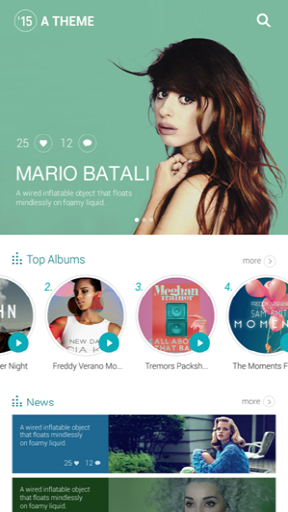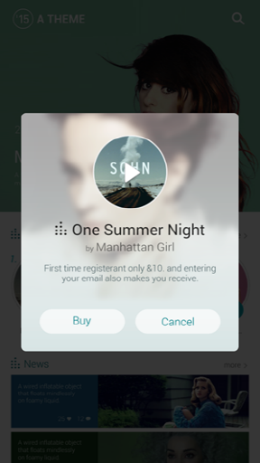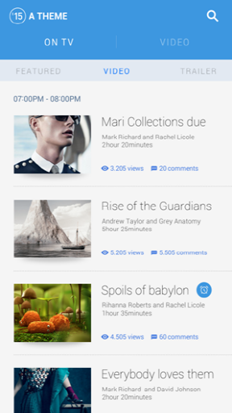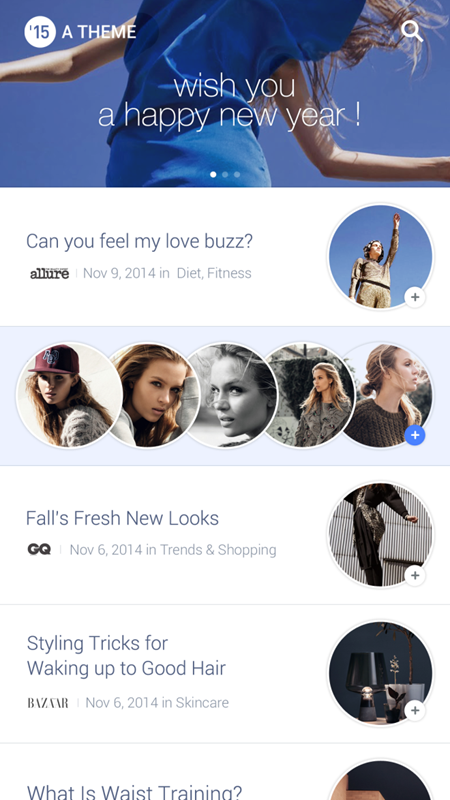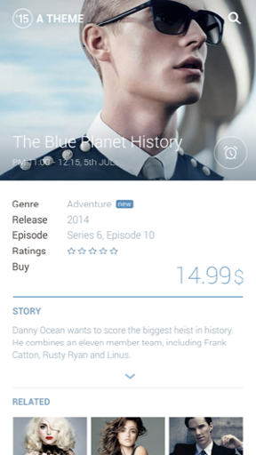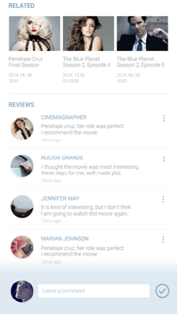

***

### [삼성 스마트 복합기](https://www.samsung.com/sec/support/model/SL-X7600GX/)
스마트복합기 Tablet에 들어가는 Setting App 담당
### 기술스택
+ Java
+ OpenGL
#### 개발인원 : 20명
#### 개발기간 : 2년~3년 중에 본인은 마지막 10개월 투입


#### screenshot
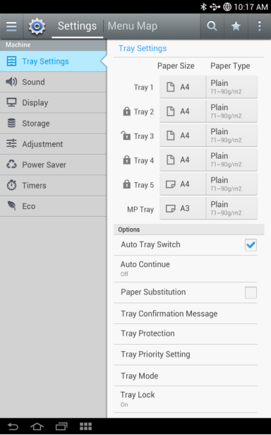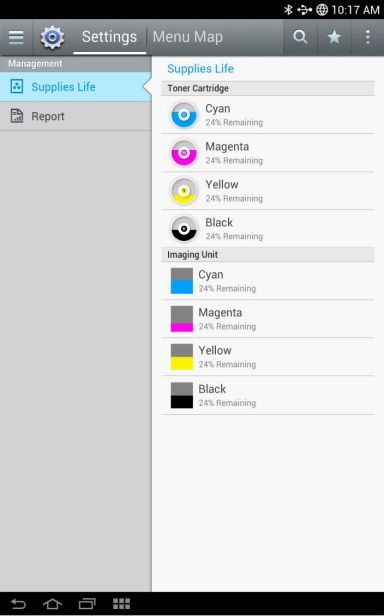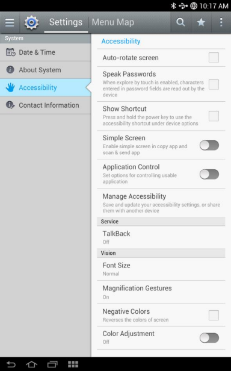
